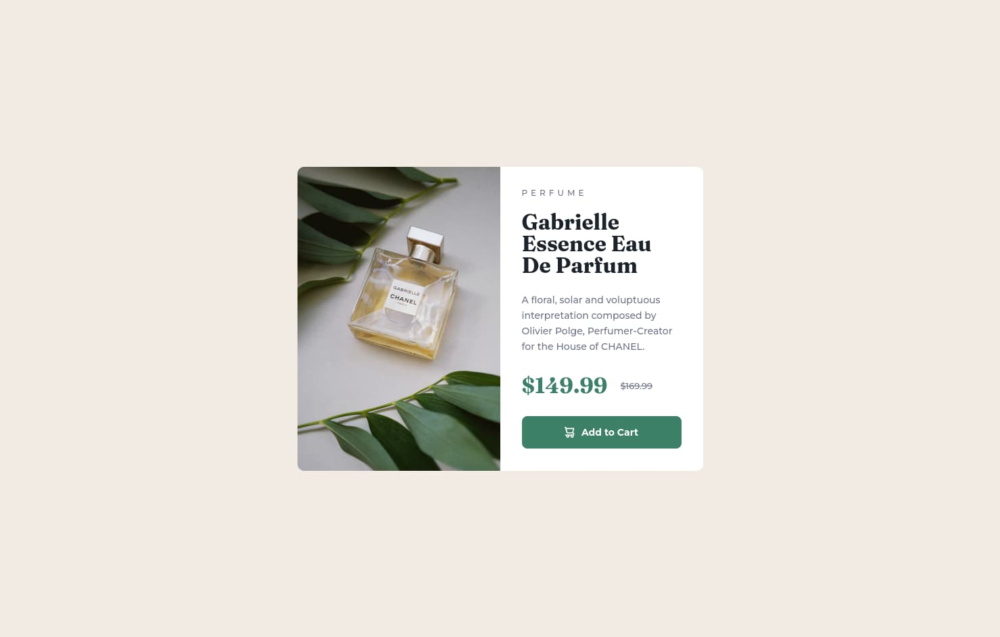

# Frontend Mentor - Product preview card component solution

This is a solution to the [Product preview card component challenge on Frontend Mentor](https://www.frontendmentor.io/challenges/product-preview-card-component-GO7UmttRfa). Frontend Mentor challenges help you improve your coding skills by building realistic projects.

## Table of contents

- [Overview](#overview)
  - [The challenge](#the-challenge)
  - [Screenshot](#screenshot)
  - [Links](#links)
- [My process](#my-process)
  - [Built with](#built-with)
  - [What I learned](#what-i-learned)
- [Author](#author)

## Overview

### The challenge

Users should be able to:

- View the optimal layout depending on their device's screen size
- See hover and focus states for interactive elements

### Screenshot

### Links

- Solution URL: [https://www.frontendmentor.io/solutions/new-product-preview-card-component-it-was-centered-using-css-grid-LFVQP6Jn0V](https://www.frontendmentor.io/solutions/new-product-preview-card-component-it-was-centered-using-css-grid-LFVQP6Jn0V)
- Live Site URL: [https://new-perfume.netlify.app/](https://new-perfume.netlify.app/)

## My process

### Built with

- Semantic HTML5 markup
- CSS custom properties
- CSS Grid
- Mobile-first workflow

### What I learned

I learned that I can build simple projects like this one in a shorter amount of time.

## Author

- Frontend Mentor - [@mexwebdev21](https://www.frontendmentor.io/profile/mexwebdev21)
- Twitter - [@mexwebdev21](https://www.twitter.com/mexwebdev21)
